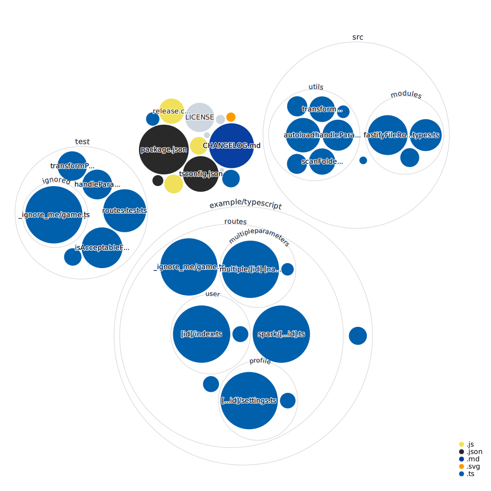

# esbuild-typescript-library-template

A template for building a library through typescript and bundling it through esbuild.

Uses yarn v3.1 alongside latest pnp support.

## Getting started

1. `git clone git@github.com:spa5k/esbuild-typescript-library-template.git my-project`
2. `cd my-project`
3. `yarn install`

### Releasing

Under the hood, this library uses [semantic-release](https://github.com/semantic-release/semantic-release) and [commitizen](https://github.com/commitizen/cz-cli).
The goal is to avoid manual release process. Using `semantic-release` will automatically create a github release (hence tags) as well as an npm release.
Based on your commit history, `semantic-release` will automatically create a patch, feature or breaking release.

### Visualization of this Repo.

Commands:

- `semantic-release`: triggers a release (used in CI)
